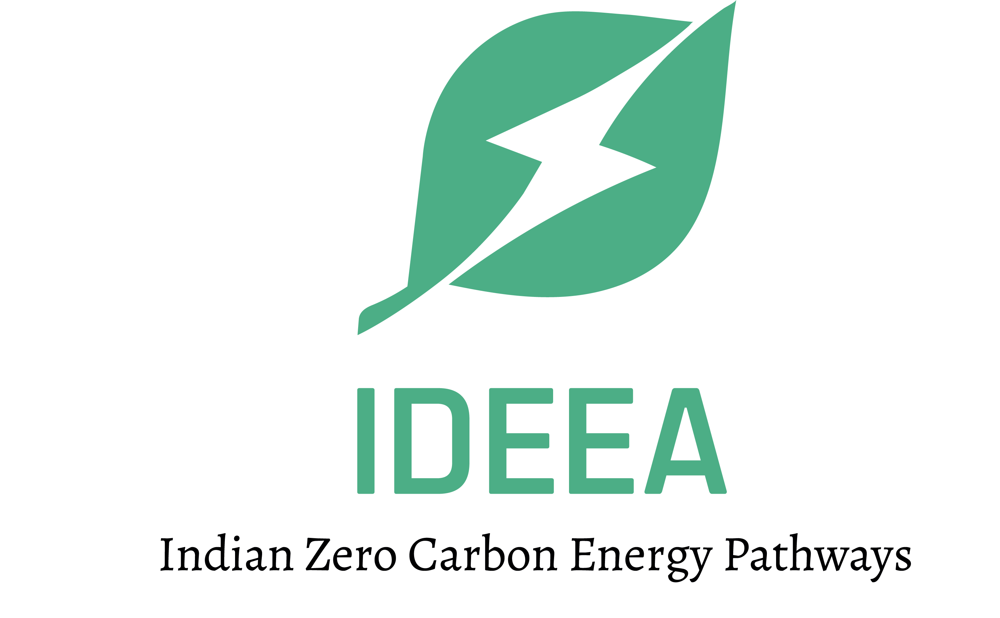

<!-- README.md is generated from README.Rmd. Please edit that file -->

```{r, include = FALSE}
knitr::opts_chunk$set(
  collapse = TRUE,
  comment = "#>",
  fig.path = "man/figures/README-",
  out.width = "100%"
)
```

# Indian Zero Carbon Energy Pathways Optimization Model 

<!-- badges: start -->

[](https://lifecycle.r-lib.org/articles/stages.html#experimental) [](https://CRAN.R-project.org/package=IDEEA.dev) [](code_of_conduct.md)

<!-- badges: end -->

<!-- ## About -->
Indian Zero Carbon Energy Pathways (IDEEA) is a collaborative open energy modeling initiative between [Environmental Defense Fund](www.edf.org), [Global Change Programme, Jadavpur University](http://juglobalchangeprogram.org/gcp/), and [Indian Institute of Science, Energy Transition Group](https://iisc.ac.in/) to develop tools and scenarios of India’s energy transition. The project aims evaluation a broad set of scenarios with high penetration of variable renewables and identify a set of most cost-efficient options of deep decarbonization and carbon neutrality for India for broad public discussion.  

## IDEEA models  
Decarbonization of electricity is a critical milestone of the energy transition to low/zero emissions. Wind and solar energy are the most sustainable options of decarbonization, and the recent reduction of costs makes them the first options to consider. However, the variability of the energy sources requires explicit modeling and evaluation of alternative balancing options, such as hydro energy, energy storage, grid, back-up capacity, and responsive demand. IDEEA project aims to develop a “new” or “renewables era” modeling framework for India to evaluate high-VER scenarios based on high temporal and spatial resolution.  

## Installation

Please refer to the step-by-step installation guide the ["Installation"](https://ideea-model.github.io/IDEEA/articles/install.html) article. The package itself can be installed from GitHub using the `pak` package:
```{r, eval=FALSE}
# install.packages("pak")
pak::pkg_install("ideea-model/IDEEA") 
library("IDEEA")
```

## Examples
For a quick example please check the [Get started](https://ideea-model.github.io/IDEEA/articles/IDEEA.html) page on the  [IDEEA R-package documentation page](https://ideea-model.github.io/IDEEA) (work in progress). More examples will be uploaded to the [ideea-model/ideea_example_project](https://github.com/ideea-model/ideea_example_project) repository.

